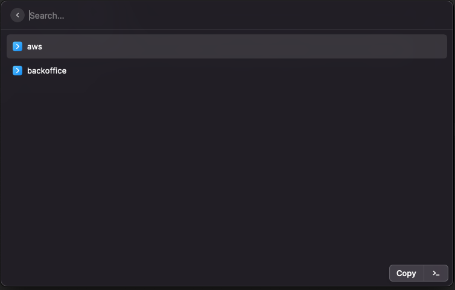
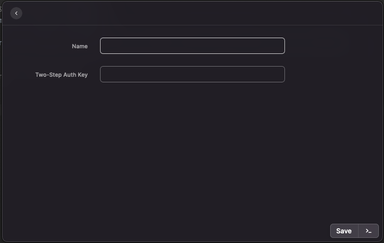

# Raycast 2FA Helper
Extension for [Raycast](https://raycast.com) to make it easier copy MFA codes to clipboard.

    
    

Add your secret/uri/qr codes here to have them ready available.

**Warning**
Please remember to keep a copy of the secret/uri/qr in a safe place as these are not stored permanently
and will not be recoverable if you remove the extension or clear the storage.

## Installing
1. Clone repo
3. Run `npm install && npm run build` in repo
4. Run the command "Import Extension" in Raycast

- You might need to create a Raycast developer account to enable the Developer extension that has the command.

### Updating
1. `git pull && npm install && npm run build`

### TODO
