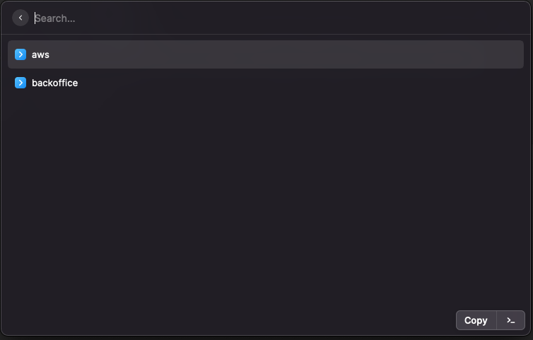
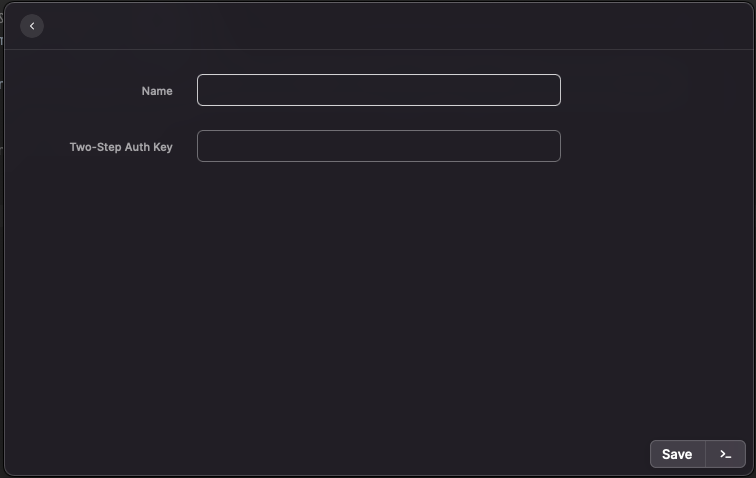

# Raycast 2FA Helper
Extension for [Raycast](https://raycast.com) to make it easier copy codes to clipboard.

    
    

## System Requirements
1. openssl

## Installing
1. Clone repo
3. Run `npm install && npm run buil` in repo
4. Run the command "Import Extension" in Raycast

- You might need to create a Raycast developer account to enable the Developer extension that has the command.

### Updating
1. `git pull && npm install && npm run build`

### TODO
